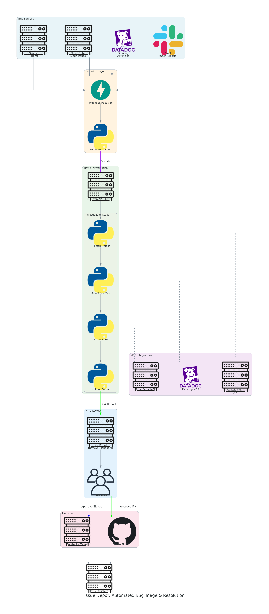
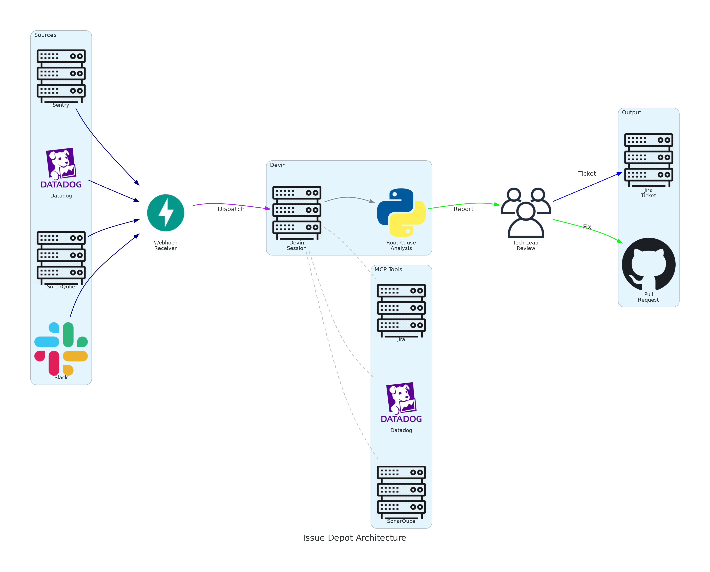

# Issue Depot Documentation

This directory contains the comprehensive plan and architecture documentation for Issue Depot - an automated bug triage and resolution system powered by Devin.

## Contents

- [ISSUE_DEPOT_PLAN.md](./ISSUE_DEPOT_PLAN.md) - Complete implementation plan including workflow, architecture, integrations, and implementation phases
- [diagrams/](./diagrams/) - Architecture diagrams

## Architecture Diagrams

### Detailed Flow Diagram

### Overview Diagram

## Quick Overview

Issue Depot automates the bug triage process through six phases:

1. **Bug Detection** - Bugs are flagged from Sentry, Datadog, or other monitoring tools
2. **Session Creation** - Webhook triggers a Devin session with the relevant repository context
3. **Bug Assessment** - Devin analyzes the bug using Datadog MCP, determines if it's noise or impactful
4. **Ticket Creation** - If impactful, Devin creates a Jira ticket via Atlassian MCP
5. **Fix Implementation** - Devin creates a branch, implements the fix, and opens a PR
6. **PR Review** - Devin performs a self-review of the PR for quality assurance

## Key Integrations

| Integration | Purpose | MCP Server |
|-------------|---------|------------|
| Sentry | Error detection and tracking | REST API + Webhooks |
| Datadog | Log analysis and APM data | Datadog MCP |
| Jira | Ticket management | Atlassian MCP |
| SonarQube | Code quality analysis | SonarQube MCP |
| GitHub | PR creation and review | Native Devin |

## Getting Started

See the [full plan document](./ISSUE_DEPOT_PLAN.md) for detailed implementation instructions, configuration requirements, and security considerations.
